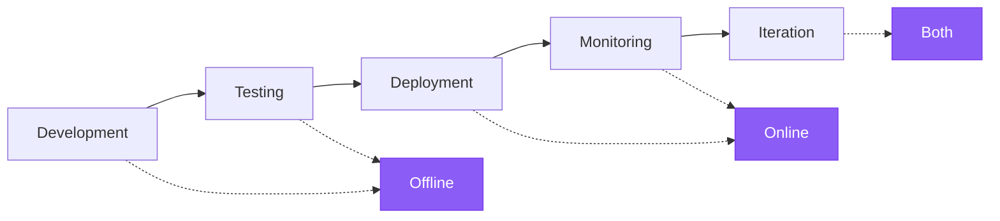

As you develop and [deploy your application](/langsmith/deployments), your evaluation strategy will evolve from pre-deployment testing (offline) to production monitoring (online). This page explains when and how to transition between these evaluation approaches.

## Evaluation lifecycle

LLM applications progress through distinct phases, each requiring different evaluation approaches. During development and testing, offline evaluations validate functionality against curated datasets. After deployment, online evaluations monitor production behavior on live traffic. As applications mature, both evaluation types work together in an iterative feedback loop to continuously improve quality.



### 1. Development with offline evaluation

When building your application before any production deployment, use offline evaluations to validate basic functionality with unit tests, benchmark different models, prompts, or architectures, and build confidence before deploying to users.

1. Create a [dataset](/langsmith/manage-datasets) with representative test cases.
1. Run [offline evaluations](/langsmith/evaluate-llm-application) to measure performance.
1. Iterate on your application based on results.
1. Compare experiments to find the best configuration.

<Card title="Get started with offline evaluation" icon="flask" href="/langsmith/evaluation-quickstart">
  Follow the quickstart to run your first offline evaluation.
</Card>

### 2. Initial deployment with online evaluation

When your application is deployed and handling real user traffic, use online evaluations to monitor production quality in real-time, detect unexpected issues or edge cases, validate that production performance matches offline testing, and collect real-world data for future offline evaluations.

1. Set up [online evaluators](/langsmith/online-evaluations) in your tracing project.
1. Start with basic checks (e.g., no errors, response format validation).
1. Configure [alerts](/langsmith/alerts) for critical quality metrics.
1. Review traces that fail online evaluations.

<Card title="Set up online evaluators" icon="radar" href="/langsmith/online-evaluations">
  Learn how to configure online evaluations for production monitoring.
</Card>

### 3. Continuous improvement

During ongoing operation and optimization, use both offline and online evaluations together in an iterative feedback loop. Online evaluations surface real-world issues and edge cases, which are then converted into dataset examples for offline testing. Offline evaluations validate fixes before redeploying, and online evaluations confirm improvements in production.

1. Online evaluations detect an issue in production.
1. Add the failing trace to a dataset as a [new example](/langsmith/manage-datasets-in-application#add-runs-to-a-dataset).
1. Reproduce and fix the issue locally.
1. Run offline evaluation to verify the fix.
1. Deploy the updated application.
1. Confirm the fix with online evaluations.

## Choose an evaluator

### Reference-free evaluators (work for both)

These evaluators don't need reference outputs and work for both offline and online evaluation:

- **Safety checks:** Toxicity, PII detection, content policy violations
- **Format validation:** JSON structure, required fields, schema compliance
- **Heuristics:** Response length, latency, specific keywords
- **Reference-free LLM-as-judge:** Clarity, coherence, helpfulness, tone

### Reference-based evaluators (offline only)

These require reference outputs and only work for offline evaluation:

- **Correctness:** Semantic similarity to reference answer
- **Factual accuracy:** Fact-checking against ground truth
- **Exact match:** Classification tasks with known labels
- **Reference-based LLM-as-judge:** Comparing output quality to a reference

## Set up online evaluators

For applications already running offline evaluations, follow these steps to add online monitoring:

### Step 1. Identify critical quality metrics

Review your offline evaluators and identify which metrics are most critical for production:
- What failures would impact users most?
- Which metrics have the tightest acceptable ranges?
- What safety checks must always pass?

### Step 2. Adapt evaluators for online

Convert critical offline evaluators to work without reference outputs:

**Example:** Converting a correctness evaluator

**Offline version (reference-based):**
```python
def evaluate_correctness(run, example):
    # Compare output to reference output
    actual = run["outputs"]["answer"]
    expected = example["outputs"]["answer"]
    return llm_judge_compare(actual, expected)
```

**Online version (reference-free):**
```python
def evaluate_correctness(run):
    # Check output quality without reference
    actual = run["outputs"]["answer"]
    question = run["inputs"]["question"]
    return llm_judge_quality(question, actual, criteria=[
        "Answers the question directly",
        "Is factually coherent",
        "Provides adequate detail"
    ])
```

### Step 3. Configure online evaluators

1. Go to your [tracing project](/langsmith/observability-concepts#tracing-projects).
1. Create [new online evaluators](/langsmith/online-evaluations#configure-online-evaluators).
1. Start with a [sampling rate](/langsmith/online-evaluations#4-optional-configure-a-sampling-rate) of 10% to control costs.
1. Monitor results and adjust sampling rate based on value vs cost.

### Step 4. Close the loop

Create a process to convert online evaluation failures into offline test cases:

1. Set up [alerts](/langsmith/alerts) for online evaluation failures.
1. Review failing traces regularly.
1. Add representative failures to your [offline datasets](/langsmith/manage-datasets-in-application#add-runs-to-a-dataset).
1. Fix issues and validate with offline evaluation before redeploying.

## Learn more

<CardGroup cols={2}>
  <Card title="Online evaluations guide" icon="radar" href="/langsmith/online-evaluations">
    Detailed guide on configuring online evaluators
  </Card>

  <Card title="Evaluation concepts" icon="circle-info" href="/langsmith/evaluation-concepts">
    Core concepts and comparison of evaluation types
  </Card>

  <Card title="Backtesting tutorial" icon="clock-rotate-left" href="/langsmith/run-backtests-new-agent">
    Learn how to backtest new versions against production data
  </Card>

  <Card title="Annotation queues" icon="comments" href="/langsmith/annotation-queues">
    Collect human feedback on production traces
  </Card>
</CardGroup>

---

<Callout icon="pen-to-square" iconType="regular">
    [Edit the source of this page on GitHub.](https://github.com/langchain-ai/docs/edit/main/src/langsmith/offline-to-online-evaluations.mdx)
</Callout>
<Tip icon="terminal" iconType="regular">
    [Connect these docs programmatically](/use-these-docs) to Claude, VSCode, and more via MCP for real-time answers.
</Tip>
