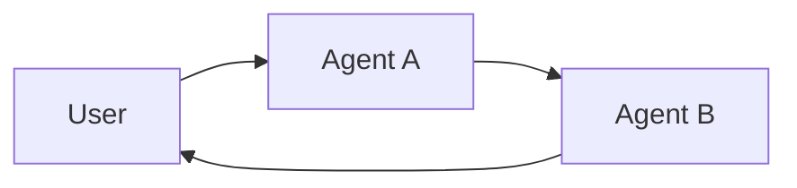

**Multi-agent systems** break a complex application into multiple specialized agents that work together to solve problems. Instead of relying on a single agent to handle every step, multi-agent architectures allow you to compose smaller, focused agents into a coordinated workflow.

Multi-agent systems are useful when:

* A single agent has too many [tools](/oss/python/langchain/tools) and makes poor decisions about which to use.
* [Context](/oss/python/concepts/context) or [memory](/oss/python/langchain/short-term-memory) grows too large for one agent to track effectively.
* Tasks require **specialization** (e.g., a planner, researcher, math expert).

## Multi-agent patterns

| Pattern                           | How it works                                                                                                                                                     | Control flow                                               | Example use case                                 |
|-----------------------------------|------------------------------------------------------------------------------------------------------------------------------------------------------------------|------------------------------------------------------------|--------------------------------------------------|
| [**Tool calling**](#tool-calling) | A **supervisor** agent calls other agents as *tools*. The “tool” agents don’t talk to the user directly — they just run their task and return results.                  | **Centralized**: all routing passes through the calling agent. | Task orchestration, structured workflows        |
| [**Handoffs**](#handoffs)         | The current agent decides to **transfer control** to another agent. The active agent changes, and the user may continue interacting directly with the new agent. | **Decentralized**: agents can change who is active.            | Multi-domain conversations, specialist takeover |

### Choose a pattern

**Use tool calling (supervisor pattern)** when:

* You have multiple distinct domains (e.g., calendar, email, CRM, database).
* Each domain has multiple tools or complex logic.
* You want centralized workflow control.
* Sub-agents don't need to converse directly with users.

For simpler cases with just a few tools, use a single agent.

**Use handoffs** when:

* Agents need to have direct conversations with users.
* The workflow requires state transitions between specialists.
* You need dynamic control flow that changes based on user interactions.

<Tip>
    You can mix both patterns! Use **handoffs** for agent switching and have each agent **call sub-agents as tools** for specialized tasks.
</Tip>

<CardGroup cols={2}>
<Card
    title="Tutorial: Build a supervisor agent"
    icon="sitemap"
    href="/oss/python/langchain/supervisor"
    arrow cta="Learn more"
>
    Learn how to build a personal assistant using the supervisor pattern, where a central supervisor agent coordinates specialized worker agents.
</Card>

<Card
    title="Tutorial: Build a customer support agent with handoffs"
    icon="people-arrows"
    href="/oss/python/langchain/customer-support-handoffs"
    arrow cta="Learn more"
>
    Learn how to build a customer support workflow using the handoffs pattern, where agents pass control through state transitions.
</Card>

</CardGroup>

## Customize agent context

At the center of multi-agent design is **[context engineering](/oss/python/langchain/context-engineering)** - deciding what information each agent sees. LangChain gives you fine-grained control over:

* Which parts of the conversation or state are passed to each agent.
* Specialized prompts tailored to sub-agents.
* Inclusion/exclusion of intermediate reasoning.
* Customizing input/output formats per agent.

The quality of your system depends on context engineering. The goal is to ensure that each agent has access to the correct data it needs to perform its task, whether it's acting as a tool or as an active agent.

## Tool calling

In tool calling, one agent (the **controller**) treats other agents as *tools* to be invoked when needed. The controller manages orchestration, while tool agents perform specific tasks and return results. For example:

1. The **controller** receives input and decides which tool (sub-agent) to call.
2. The **tool agent** runs its task based on the controller's instructions.
3. The **tool agent** returns results to the controller.
4. The **controller** decides the next step or finishes.


```mermaid
graph LR
    A[User] --> B[Controller agent]
    B --> C[Tool agent 1]
    B --> D[Tool agent 2]
    C --> B
    D --> B
    B --> E[User response]
````

<Tip>
    Agents used as tools are generally **not expected** to continue the conversation with the user. Their role is to perform a task and return results to the controller agent. If you need sub-agents to be able to converse with the user, use [handoffs](#handoffs) instead.
</Tip>

### Implement tool calling

The example below shows how a main agent is given access to a single sub-agent via a tool definition:

```python
from langchain.tools import tool
from langchain.agents import create_agent


subagent1 = create_agent(model="...", tools=[...])

@tool(
    "subagent1_name",
    description="subagent1_description"
)
def call_subagent1(query: str):
    result = subagent1.invoke({
        "messages": [{"role": "user", "content": query}]
    })
    return result["messages"][-1].content

agent = create_agent(model="...", tools=[call_subagent1])
```


In this pattern:

1. The main agent invokes `call_subagent1` when it decides the task matches the sub-agent's description.
2. The sub-agent runs independently and returns its result.
3. The main agent receives the result and continues orchestration.

### Where to customize

There are several points where you can control how context is passed between the main agent and its subagents:

1. **Sub-agent name** (`"subagent1_name"`): This is how the main agent refers to the sub-agent. Since it influences prompting, choose it carefully.
2. **Sub-agent description** (`"subagent1_description"`): This is what the main agent knows about the sub-agent. It directly shapes how the main agent decides when to call it.
3. **[Input to the sub-agent](#control-the-input-to-the-sub-agent)**: You can customize this input to better shape how the sub-agent interprets tasks. In the example above, we pass the agent-generated `query` directly.
4. **[Output from the sub-agent](#control-the-output-from-the-sub-agent)**: This is the response passed back to the main agent. You can adjust what is returned to control how the main agent interprets results. In the example above, we return the final message text, but you could return additional state or metadata.

#### Control the input to the sub-agent

There are two main levers to control the input that the main agent passes to a sub-agent:

* **Modify the prompt**: Adjust the main agent's prompt or the tool metadata (i.e., sub-agent's name and description) to better guide when and how it calls the sub-agent.
* **Context injection**: Add input that isn't practical to capture in a static prompt (e.g., full message history, prior results, task metadata) by adjusting the tool call to pull from the agent's state.

```python
from langchain.agents import AgentState
from langchain.tools import tool, ToolRuntime

class CustomState(AgentState):
    example_state_key: str

@tool(
    "subagent1_name",
    description="subagent1_description"
)
def call_subagent1(query: str, runtime: ToolRuntime[None, CustomState]):
    # Apply any logic needed to transform the messages into a suitable input
    subagent_input = some_logic(query, runtime.state["messages"])
    result = subagent1.invoke({
        "messages": subagent_input,
        # You could also pass other state keys here as needed.
        # Make sure to define these in both the main and subagent's
        # state schemas.
        "example_state_key": runtime.state["example_state_key"]
    })
    return result["messages"][-1].content
```


#### Control the output from the sub-agent

Two common strategies for shaping what the main agent receives back from a sub-agent:

* **Modify the prompt**: Refine the sub-agent's prompt to specify exactly what should be returned.
  * Useful when outputs are incomplete, too verbose, or missing key details.
  * A common failure mode is that the sub-agent performs tool calls or reasoning but does **not include the results** in its final message. Remind it that the controller (and user) only see the final output, so all relevant info must be included there.
* **Custom output formatting**: Adjust or enrich the sub-agent's response in code before handing it back to the main agent.
  * Example: pass specific state keys back to the main agent in addition to the final text.
  * This requires wrapping the result in a [`Command`](https://reference.langchain.com/python/langgraph/types/#langgraph.types.Command) (or equivalent structure) so you can merge custom state with the sub-agent's response.

```python
from typing import Annotated
from langchain.agents import AgentState
from langchain.tools import InjectedToolCallId
from langgraph.types import Command


@tool(
    "subagent1_name",
    description="subagent1_description"
)
# We need to pass the `tool_call_id` to the sub agent so it can use it to respond with the tool call result
def call_subagent1(
    query: str,
    tool_call_id: Annotated[str, InjectedToolCallId],
# You need to return a `Command` object to include more than just a final tool call
) -> Command:
    result = subagent1.invoke({
        "messages": [{"role": "user", "content": query}]
    })
    return Command(update={
        # This is the example state key we are passing back
        "example_state_key": result["example_state_key"],
        "messages": [
            ToolMessage(
                content=result["messages"][-1].content,
                # We need to include the tool call id so it matches up with the right tool call
                tool_call_id=tool_call_id
            )
        ]
    })
```


## Handoffs

In **handoffs**, agents pass control to each other through **state transitions**. Think of it as a state machine where the system tracks which agent is currently active, and that agent's configuration (system prompt, tools, etc.) determines the behavior. For example:

1. The **current agent** decides it needs to transfer control to another agent.
2. It updates a state variable (e.g., `active_agent`) using a tool that modifies the graph state.
3. On the next conversational turn, the graph reads this state and configures itself with the **new agent's** system prompt, tools, and behavior.
4. The **new agent** interacts directly with the user until it decides to hand off again or finish.



### When to use handoffs

Handoffs are particularly valuable for **"online"** customer support scenarios where you need to collect information from users in a specific sequence. For example:

* Collecting a warranty ID before processing a refund.
* Gathering account details before escalating to a specialist.
* Verifying identity before accessing sensitive information.

The key advantage is **sequential unlocking** - you can design workflows where additional options or agents become available only after required information has been collected.

<Tip>
    Design handoff flows carefully to avoid creating rigid, frustrating experiences. Users should be able to:
    * Correct typos or mistakes in previously provided information.
    * Change the conversation flow when appropriate.
    * Navigate back to previous steps if needed.

    Overly restrictive handoff patterns can feel like poorly designed phone trees.
</Tip>

### How handoffs work

At the core, handoffs rely on [persistent state](/oss/python/langchain/short-term-memory) that survives across conversation turns:

1. **State variable**: A field in your state schema (e.g., `active_agent: str`) tracks which agent is currently active.
2. **State update tool**: The agent uses a tool to change the value of `active_agent` when handing off control.
3. **Dynamic configuration**: On each turn, the graph entry point reads `active_agent` from the persisted state and dynamically configures the appropriate system prompt, tools, and behavior for that agent.

This pattern creates a state machine where each agent represents a distinct state with its own behavior and capabilities. The state persists between user messages, allowing the conversation to resume with the correct agent configuration.

### Implement handoffs

The example below shows a complete example of a customer support workflow with handoffs between different stages using [`create_agent`](https://reference.langchain.com/python/langchain/agents/#langchain.agents.create_agent), [`@wrap_model_call`](https://reference.langchain.com/python/langchain/middleware/#langchain.agents.middleware.wrap_model_call) middleware, and [`@tool`](https://reference.langchain.com/python/langchain/tools/#langchain.tools.tool) decorators:

```python
from collections.abc import Callable
from typing import Literal, NotRequired

from langchain.agents import AgentState, create_agent
from langchain.agents.middleware import ModelRequest, ModelResponse, wrap_model_call
from langchain.chat_models import init_chat_model
from langchain.tools import ToolRuntime, tool
from langchain_core.messages import ToolMessage
from langgraph.checkpoint.memory import InMemorySaver
from langgraph.types import Command

model = init_chat_model("anthropic:claude-3-5-sonnet-latest")

# Define the possible workflow stages
SupportStage = Literal[
    "warranty_collector", "issue_classifier", "resolution_specialist"
]

# Define custom state schema with current_stage field
class SupportState(AgentState):
    """State for customer support workflow with handoffs."""
    current_stage: NotRequired[SupportStage]
    warranty_status: NotRequired[Literal["in_warranty", "out_of_warranty"]]
    issue_type: NotRequired[Literal["hardware", "software"]]

# Define tools that transition between stages
@tool
def record_warranty_status(
    status: Literal["in_warranty", "out_of_warranty"],
    runtime: ToolRuntime[None, SupportState],
) -> Command:
    """Record the customer's warranty status and transition to issue classification."""
    return Command(
        update={
            "messages": [
                ToolMessage(
                    content=f"Warranty status recorded as: {status}",
                    tool_call_id=runtime.tool_call_id,
                )
            ],
            "warranty_status": status,
            "current_stage": "issue_classifier",  # State transition
        }
    )

@tool
def record_issue_type(
    issue_type: Literal["hardware", "software"],
    runtime: ToolRuntime[None, SupportState],
) -> Command:
    """Record the type of issue and transition to resolution specialist."""
    return Command(
        update={
            "messages": [
                ToolMessage(
                    content=f"Issue type recorded as: {issue_type}",
                    tool_call_id=runtime.tool_call_id,
                )
            ],
            "issue_type": issue_type,
            "current_stage": "resolution_specialist",  # State transition
        }
    )

@tool
def provide_solution(solution: str, _runtime: ToolRuntime[None, SupportState]) -> str:
    """Provide a solution to the customer's issue."""
    return f"Solution provided: {solution}"

@tool
def escalate_to_human(reason: str, _runtime: ToolRuntime[None, SupportState]) -> str:
    """Escalate the case to a human support specialist."""
    return f"Escalating to human support. Reason: {reason}"

# Define stage configurations (prompts and tools for each stage)
STAGE_CONFIG = {
    "warranty_collector": {
        "prompt": """You are a customer support agent helping with device issues.

CURRENT STAGE: Warranty verification

At this stage, you need to:
1. Greet the customer warmly
2. Ask if their device is under warranty
3. Use record_warranty_status to record their response and move to the next stage

Be conversational and friendly.""",
        "tools": [record_warranty_status],
    },
    "issue_classifier": {
        "prompt": """You are a customer support agent helping with device issues.

CURRENT STAGE: Issue classification
CUSTOMER INFO: Warranty status is {warranty_status}

At this stage, you need to:
1. Ask the customer to describe their issue
2. Determine if it's a hardware or software issue
3. Use record_issue_type to record the classification

If unclear, ask clarifying questions before classifying.""",
        "tools": [record_issue_type],
    },
    "resolution_specialist": {
        "prompt": """You are a customer support agent helping with device issues.

CURRENT STAGE: Resolution
CUSTOMER INFO: Warranty status is {warranty_status}, issue type is {issue_type}

At this stage, you need to:
1. For SOFTWARE issues: provide troubleshooting steps using provide_solution
2. For HARDWARE issues:
   - If IN WARRANTY: explain warranty repair process using provide_solution
   - If OUT OF WARRANTY: escalate_to_human for paid repair options

Be specific and helpful in your solutions.""",
        "tools": [provide_solution, escalate_to_human],
    },
}

# Middleware that dynamically configures agent based on current_stage
@wrap_model_call
async def apply_stage_config(
    request: ModelRequest,
    handler: Callable[[ModelRequest], ModelResponse],
) -> ModelResponse:
    """Configure agent behavior based on the current stage."""
    # Get current stage (defaults to warranty_collector for first interaction)
    current_stage = request.state.get("current_stage", "warranty_collector")

    # Look up stage configuration
    stage_config = STAGE_CONFIG[current_stage]

    # Format prompt with state values
    system_prompt = stage_config["prompt"].format(**request.state)

    # Inject system prompt and stage-specific tools
    request = request.override(
        system_prompt=system_prompt,
        tools=stage_config["tools"],
    )

    return await handler(request)

# Create agent with all tools and stage-switching middleware
all_tools = [
    record_warranty_status,
    record_issue_type,
    provide_solution,
    escalate_to_human,
]

agent = create_agent(
    model,
    tools=all_tools,
    state_schema=SupportState,
    middleware=[apply_stage_config],  # Dynamic configuration
    checkpointer=InMemorySaver(),  # Required for state persistence
)

# Use the agent
config = {"configurable": {"thread_id": "support-001"}}

# Turn 1: Warranty collection
agent.invoke(
    {"messages": [{"role": "user", "content": "Hi, my phone screen is cracked"}]},
    config
)

# Turn 2: User responds about warranty
agent.invoke(
    {"messages": [{"role": "user", "content": "Yes, it's under warranty"}]},
    config
)

# Turn 3: Issue classification
agent.invoke(
    {"messages": [{"role": "user", "content": "The screen is physically cracked"}]},
    config
)

# Turn 4: Resolution
result = agent.invoke(
    {"messages": [{"role": "user", "content": "What should I do?"}]},
    config
)
```


**Key implementation details:**

1. **[Custom state schema](/oss/python/langchain/short-term-memory#customizing-agent-memory)** ([`AgentState`](https://reference.langchain.com/python/langchain/agents/#langchain.agents.AgentState)) with `current_stage` field tracks which agent is active
2. **[Tools return `Command` objects](/oss/python/langchain/short-term-memory#write-short-term-memory-from-tools)** ([`Command`](https://reference.langchain.com/python/langgraph/types/#langgraph.types.Command)) to update both state and messages
3. **[`@wrap_model_call`](https://reference.langchain.com/python/langchain/middleware/#langchain.agents.middleware.wrap_model_call) [middleware](/reference/python/docs/langchain/middleware#decorators)** ([`ModelRequest`](https://reference.langchain.com/python/langchain/middleware/#langchain.agents.middleware.ModelRequest), @[`ModelResponse`]) reads state and dynamically configures prompts and tools
4. **[Checkpointer](/oss/python/langchain/short-term-memory#usage)** ([`InMemorySaver`](https://reference.langchain.com/python/langgraph/checkpoints/#langgraph.checkpoint.memory.InMemorySaver)) persists state across conversation turns

## Manage message history

A critical aspect of handoffs is managing what each agent sees in the conversation history. Without proper management, message history grows unbounded and agents can get confused by other agents' conversations.

For example, in a multi-stage handoff workflow, the full message history includes conversations from all previous agents:

```python
# After 3 agent transitions, full history contains:
[
    HumanMessage("Hi, my phone screen is cracked"),
    AIMessage("Is your device under warranty?"),  # warranty_collector
    HumanMessage("Yes, it's under warranty"),
    AIMessage("Tool: record_warranty_status"),     # warranty_collector
    ToolMessage("Recorded warranty status"),
    AIMessage("Can you describe the issue?"),      # issue_classifier
    HumanMessage("The screen is physically cracked"),
    AIMessage("Tool: record_issue_type"),          # issue_classifier
    ToolMessage("Recorded issue type"),
    AIMessage("I can help with warranty repair"),  # resolution_specialist
]
```

This creates the following problems:

- Message history grows unbounded as the workflow progresses
- Each agent sees conversations from previous agents
- Agents can get confused by other agents' messages
- Context windows fill up with irrelevant information

To solve these problems, you can implement [agent-scoped message histories](#agent-scoped-message-histories).

### Agent-scoped message histories

Message history should be separated from cross-agent memory:

* **Message history**: Agent-scoped, bounded, and ephemeral (what the agent sees)
* **State dict**: Cross-agent, persistent, structured data (what the agent knows)
* **System messages**: Bridge between state and context (injected summaries)

You can implement message scoping using [`@before_model`](https://reference.langchain.com/python/langchain/middleware/#langchain.agents.middleware.before_model) [middleware that trims messages](/oss/python/langchain/short-term-memory#trim-messages) before each agent sees them. The example below shows how to implement message scoping using [`@before_model`](https://reference.langchain.com/python/langchain/middleware/#langchain.agents.middleware.before_model) middleware:

```python
from langchain.agents.middleware import before_model
from langchain.messages import RemoveMessage
from langgraph.graph.message import REMOVE_ALL_MESSAGES

@before_model
def scope_messages_to_agent(state: SupportState, runtime: Runtime) -> dict | None:
    """Keep only recent messages for the current agent."""
    messages = state["messages"]

    # Keep only last 2-3 conversation turns
    if len(messages) <= 4:
        return None

    # Always keep the first message, trim the middle
    first_msg = messages[0]
    recent_messages = messages[-4:]
    new_messages = [first_msg] + recent_messages

    return {
        "messages": [
            RemoveMessage(id=REMOVE_ALL_MESSAGES),
            *new_messages
        ]
    }

agent = create_agent(
    model,
    tools=all_tools,
    state_schema=SupportState,
    middleware=[apply_stage_config, scope_messages_to_agent],
    checkpointer=InMemorySaver(),
)
```


### Inject context from state

Since agents only see recent messages, use [`@wrap_model_call`](https://reference.langchain.com/python/langchain/middleware/#langchain.agents.middleware.wrap_model_call) middleware to inject context about what previous agents learned into the system prompt:

```python
@wrap_model_call
async def apply_stage_config(
    request: ModelRequest,
    handler: Callable[[ModelRequest], ModelResponse],
) -> ModelResponse:
    current_stage = request.state.get("current_stage", "warranty_collector")
    stage_config = STAGE_CONFIG[current_stage]

    # Build context summary from state
    context = []
    if request.state.get("warranty_status"):
        context.append(f"Warranty status: {request.state['warranty_status']}")
    if request.state.get("issue_type"):
        context.append(f"Issue type: {request.state['issue_type']}")

    # Inject context into system prompt
    system_prompt = stage_config["prompt"]
    if context:
        system_prompt += f"\n\nContext from previous agents:\n" + "\n".join(context)

    request = request.override(
        system_prompt=system_prompt,
        tools=stage_config["tools"],
    )

    return await handler(request)
```

This approach ensures:
- ✅ Bounded message history (only recent turns)
- ✅ Each agent sees only its own conversation
- ✅ Context from previous agents available via system prompt
- ✅ State provides structured cross-agent memory

See [message trimming strategies](/oss/python/langchain/short-term-memory#common-patterns) for more techniques.

## Allowing users to navigate back

A key UX requirement is allowing users to correct mistakes in handoff workflows. Add [`@tool`](https://reference.langchain.com/python/langchain/tools/#langchain.tools.tool)s that return [`Command`](https://reference.langchain.com/python/langgraph/types/#langgraph.types.Command) objects to let agents navigate backward:

```python
@tool
def go_back_to_warranty(
    runtime: ToolRuntime[None, SupportState]
) -> Command:
    """Go back to warranty verification step."""
    return Command(update={
        "current_stage": "warranty_collector",
        "warranty_status": None,  # Reset warranty status
        "messages": [
            ToolMessage(
                content="Returning to warranty verification",
                tool_call_id=runtime.tool_call_id,
            )
        ]
    })

@tool
def go_back_to_classification(
    runtime: ToolRuntime[None, SupportState]
) -> Command:
    """Go back to issue classification step."""
    return Command(update={
        "current_stage": "issue_classifier",
        "issue_type": None,  # Reset issue type
        "messages": [
            ToolMessage(
                content="Returning to issue classification",
                tool_call_id=runtime.tool_call_id,
            )
        ]
    })

# Add navigation tools to resolution specialist
STAGE_CONFIG["resolution_specialist"]["tools"].extend([
    go_back_to_warranty,
    go_back_to_classification,
])

# Update prompt to mention navigation
STAGE_CONFIG["resolution_specialist"]["prompt"] += """

If the customer indicates any information was wrong:
- Use go_back_to_warranty to correct warranty status
- Use go_back_to_classification to correct issue type"""
```


Now users can correct mistakes:

```python
# User realizes they made a mistake
agent.invoke(
    {"messages": [{"role": "user", "content": "Actually, my device is out of warranty"}]},
    config
)
# Agent uses go_back_to_warranty tool, returns to warranty_collector stage
```

## Best practices

When implementing handoffs:

1. **Bound message histories**: Use [`trim_messages`](https://reference.langchain.com/python/langchain/messages/#langchain.messages.trim_messages) or [`@before_model`](https://reference.langchain.com/python/langchain/middleware/#langchain.agents.middleware.before_model) [middleware](/oss/python/langchain/short-term-memory#trim-messages) to prevent unbounded growth.
2. **State for cross-agent memory**: Store structured data (warranty status, issue type) in [`AgentState`](https://reference.langchain.com/python/langchain/agents/#langchain.agents.AgentState) [custom state](/oss/python/langchain/short-term-memory#customizing-agent-memory), not message history.
3. **Inject context summaries**: Add state information to system prompts so agents know what previous agents learned.
4. **Validate state transitions**: Check required state exists before allowing transitions to later stages.
5. **Allow backward navigation**: Provide [`@tool`](https://reference.langchain.com/python/langchain/tools/#langchain.tools.tool)s that return [`Command`](https://reference.langchain.com/python/langgraph/types/#langgraph.types.Command) objects for users to correct mistakes and return to previous stages.
6. **Ensure valid message sequences**: Make sure message histories follow provider requirements (user → AI → tool alternation).
7. **Use checkpointers**: Always include a [`InMemorySaver`](https://reference.langchain.com/python/langgraph/checkpoints/#langgraph.checkpoint.memory.InMemorySaver) [checkpointer](/oss/python/langchain/short-term-memory#usage) to persist state across turns.

---

<Callout icon="pen-to-square" iconType="regular">
    [Edit the source of this page on GitHub.](https://github.com/langchain-ai/docs/edit/main/src/oss/langchain/multi-agent.mdx)
</Callout>
<Tip icon="terminal" iconType="regular">
    [Connect these docs programmatically](/use-these-docs) to Claude, VSCode, and more via MCP for real-time answers.
</Tip>
